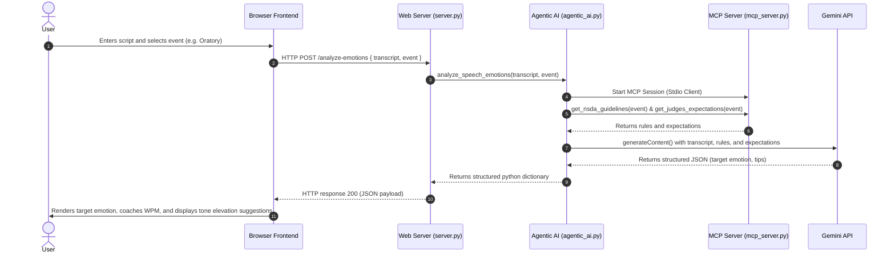

# Application Architecture - NSDA Speech Evaluator with Agentic AI

This document details the system design, components, and data flow of the NSDA Speech Evaluator. The application integrates a frontend speech timer and vocal delivery tool with a local python server, a Model Context Protocol (MCP) knowledge base, and an Agentic AI analyzer powered by Gemini.

---

## Component Diagram

```mermaid
graph TD
    Client[Browser Frontend: index.html / app.js] <--> |HTTP POST /analyze-emotions & /synthesize| WebServer[Python Web Server: server.py]
    WebServer <--> |Calls Function| Agent[Agentic AI: agentic_ai.py]
    Agent <--> |Spawns & Queries Stdio| MCPServer[MCP Server: mcp_server.py]
    Agent <--> |Gemini API Requests (Text & Audio Modality)| Gemini[Gemini API: gemini-2.5-flash]
```

---

## Component Details

### 1. Browser Frontend (`app.js` & `index.html`)
* **Role**: Collects audio recordings or uploads, calculates real-time pacing (WPM) and speech length, displays the visual score dashboard, and renders the emotion matrix.
* **Agentic Integration**: 
  * When a transcript is entered or transcribed, the frontend issues an asynchronous `fetch` request to `/analyze-emotions` with the transcript text and event type.
  * In the **Expressive Voice Clone Synthesis** section, when the user clicks "Generate", it compiles the SSML for the script and requests speech audio via `/synthesize`, which is played directly.

### 2. Python Web Server (`server.py`)
* **Role**: Serves the static files (HTML, CSS, JS) on port `8080` and provides backend API routes.
* **Endpoints**:
  * `/transcribe`: Accepts WAV audio, stores it temporarily, and uses Python's speech recognition to transcribe it.
  * `/analyze-emotions`: Receives the transcript and event type, boots the local environment configurations, calls the `agentic_ai` orchestrator, and returns the response as JSON.
  * `/synthesize`: Receives SSML and voice name, invokes Gemini's audio modality model, and streams back the generated WAV speech.

### 3. Agentic AI Orchestrator (`agentic_ai.py`)
* **Role**: Performs the reasoning and self-reflection loops.
* **Orchestration**: 
  1. Bootstraps and establishes an MCP client connection to `mcp_server.py` using Stdio transport.
  2. Queries the MCP server tools for the specific event's rules and expectations.
  3. Combines the transcript, rules, and expectations into a unified prompt.
  4. Invokes the `google-genai` Python client using the `gemini-2.5-flash` model.
  5. Requests a strict JSON output matching the expected response schema.

### 4. Local MCP Knowledge Base Server (`mcp_server.py`)
* **Role**: Exposes NSDA guidelines and judges' expectations as structured tools.
* **Tools**:
  * `get_nsda_guidelines(event)`: Official rules, time limits, and quote limits.
  * `get_judges_expectations(event)`: Qualitative criteria used in speech ballots.
  * `get_vocal_coaching_tips(emotion)`: Vocal delivery guidance and advice.

### 5. Google Gemini API (`gemini-2.5-flash`)
* **Role**: Conducts the NLP analysis on the speech transcript.
* **Analysis**: Classifies the transcript's emotional segments, maps them to NSDA event expectations, and returns vocal delivery tips and emotional transition guidelines.

---

## Data Flow Sequence


